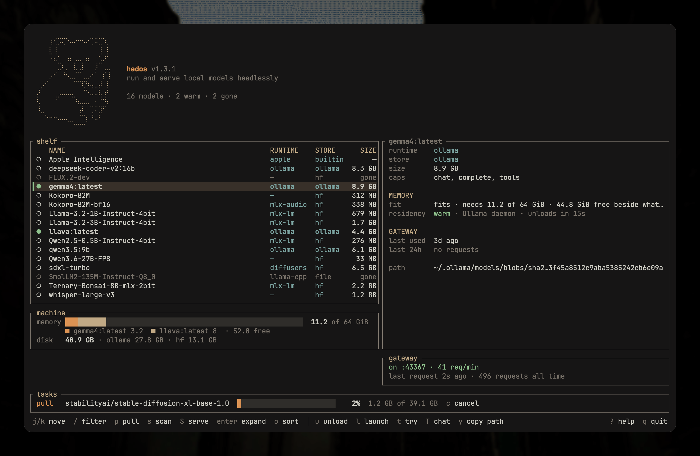
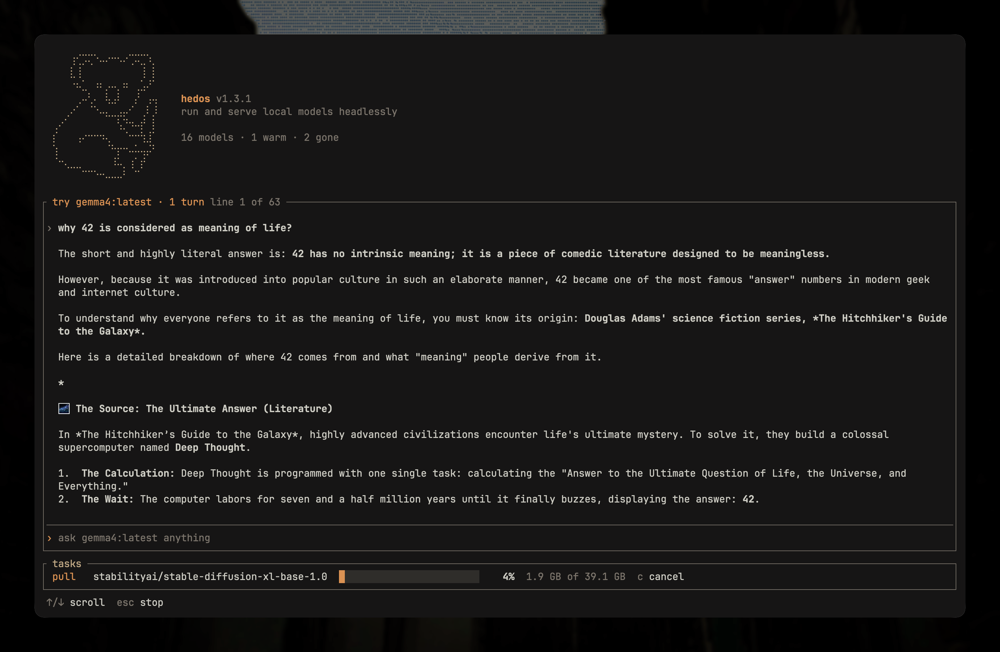

<picture>
  <source media="(prefers-color-scheme: dark)" srcset="assets/banner-dark.svg">
  
</picture>

<br/>

<p>
  <a href="https://github.com/theiskaa/hedos/actions/workflows/ci.yml"></a>
  <a href="https://hedos.ai/docs"></a>
  <a href="https://crates.io/crates/hedos"></a>
  <a href="https://github.com/theiskaa/hedos/releases"></a>
  <a href="Cargo.toml"></a>
  <a href="LICENSE"></a>
  <a href="https://crates.io/crates/hedos"></a>
</p>

hedos is a headless engine for the local models already on your machine. It finds them wherever they live, installs new ones, and serves each through the runtime that actually fits, all from one binary and a local HTTP gateway. No app, no browser wrapper: everything runs on your hardware, offline.

It scans where models really sit (the Ollama store, the Hugging Face cache, LM Studio's library, loose GGUF and safetensors files) and puts them on one shelf without moving a byte. Each is resolved to the runtime that serves it (llama-server, Ollama, an OpenAI-compatible endpoint, or a managed Python sidecar) with its real context length, chat template, and tool-calling dialect, so a conversation behaves the same across engines. Where a model cannot do something, the shelf says so up front.

## Install
```sh
curl -fsSL https://hedos.ai/install | bash
```

### Cargo
```sh
cargo install hedos
```

### Homebrew
```sh
brew install theiskaa/tap/hedos
```

### Prebuilt binaries
Prebuilt versions are available in our [GitHub releases](https://github.com/theiskaa/hedos/releases/latest):

|  File  | Platform | Checksum |
|--------|----------|----------|
| [hedos-aarch64-apple-darwin.tar.xz](https://github.com/theiskaa/hedos/releases/latest/download/hedos-aarch64-apple-darwin.tar.xz) | Apple Silicon macOS | [checksum](https://github.com/theiskaa/hedos/releases/latest/download/hedos-aarch64-apple-darwin.tar.xz.sha256) |
| [hedos-x86_64-apple-darwin.tar.xz](https://github.com/theiskaa/hedos/releases/latest/download/hedos-x86_64-apple-darwin.tar.xz) | Intel macOS | [checksum](https://github.com/theiskaa/hedos/releases/latest/download/hedos-x86_64-apple-darwin.tar.xz.sha256) |
| [hedos-aarch64-unknown-linux-gnu.tar.xz](https://github.com/theiskaa/hedos/releases/latest/download/hedos-aarch64-unknown-linux-gnu.tar.xz) | ARM64 Linux | [checksum](https://github.com/theiskaa/hedos/releases/latest/download/hedos-aarch64-unknown-linux-gnu.tar.xz.sha256) |
| [hedos-x86_64-unknown-linux-gnu.tar.xz](https://github.com/theiskaa/hedos/releases/latest/download/hedos-x86_64-unknown-linux-gnu.tar.xz) | x64 Linux | [checksum](https://github.com/theiskaa/hedos/releases/latest/download/hedos-x86_64-unknown-linux-gnu.tar.xz.sha256) |

### Optional backends
hedos serves whatever your machine can already run, so nothing else is required to start. Add these when you want the runtimes that need them:

- [`uv`](https://astral.sh/uv) for the Python sidecar runtimes (mlx-lm, mlx-vlm, speech, embeddings, diffusers, mflux, whisper). They provision their own environments the first time they run; the runtime code itself ships inside the binary.
- A `llama-server` binary on the `PATH` for local GGUF files.
- The Ollama daemon for models it manages.

## Quick start
```sh
hedos scan                          # discover every model on this machine
hedos ls                            # list them with runtime, store, fit, and capabilities
hedos shelf                         # the shelf as a terminal screen
hedos pull qwen2.5:3b               # install from ollama or hugging face
hedos run gemma3 "explain this"     # stream a completion to your terminal
hedos run llava "describe" --image photo.png   # ask a vision model about an image
hedos transcribe whisper voice.wav  # transcribe an audio file to text
hedos rm gemma3 --yes               # delete a model
hedos serve                         # start the local gateway
hedos launch opencode               # run a coding harness on a local model
hedos stats                         # per-model usage from the gateway audit log
```

Every command takes `--json` when you want machine-readable output instead of formatted text. `hedos ls` shows a fit verdict — whether each model will actually run in this machine's memory — next to its capabilities.

## The shelf in the terminal


`hedos shelf` is the same shelf as a screen you keep open: every model with its runtime, store, and size; the selected one's fit, residency, and capabilities; what is loaded and by whom, with a memory bar per model; disk per store; and what the gateway served in the last day. The footer shows only the keys that apply to the model under the cursor, and every key is a subcommand: `p` pulls, `w` and `u` warm and unload, `x` removes with a preview, `S` serves.

Press `t` and the shelf gives way to a conversation with the selected model. The reply streams in, keeps its markdown, scrolls with the wheel or the arrows and holds still while more text arrives, and the model stays warm for whatever comes next. `T` opens `hedos chat` in the plain terminal instead, `l` launches a coding harness on the model: the UI steps aside for anything that needs the terminal and is back the moment it ends, with a row in the task strip saying how it went.



Pulls download in the task strip while you keep working; `c` asks whether to pause or cancel one, and `P` opens a screen of every pull with the selected one's rate, estimate, and history. Every text field edits like a shell line (Ctrl-A/E, Ctrl-U, Ctrl-W, the arrows). It works over ssh and inside tmux. See the [`hedos shelf` reference](docs/cli.md#hedos-shelf).

## Coding harnesses
`hedos launch` runs a coding harness against a local model with nothing to configure. The gateway starts inside the same process on a free port, the harness is wired to it, and both stop together:

```sh
hedos launch                      # pick a harness, then a model
hedos launch claude -m qwen3      # or name both
```

Claude Code, OpenCode, Aider, Goose, and Crush are supported; the interactive picker lists the ones installed on your `PATH`, so it never offers a harness that would then fail to launch. Naming one you do not have points you at where to get it. Your own harness config is never touched, so running the harness directly afterwards behaves exactly as it did before.

## The gateway
`hedos serve` binds an OpenAI-, Ollama-, and Anthropic-compatible HTTP server to loopback (`127.0.0.1:43367` by default). Any editor, script, or agent on the machine can point at it and reach the models you own, tools and all:

```sh
curl http://127.0.0.1:43367/v1/chat/completions \
  -d '{"model":"qwen2.5","messages":[{"role":"user","content":"hi"}]}'
```

The gateway is bound to loopback and treats every local caller as trusted. It does not require a token. Keep it on `127.0.0.1`; see [SECURITY.md](SECURITY.md) for what that means.

## Managing models
The shelf is not read-only. The install service resolves a reference (a `huggingface.co` or `ollama.com` link, an `org/repo`, or a `name:tag`) and plans the install before a byte moves: the file set, the sizes, the destination, and the pinned revision.

Installs write into each platform's native habitat. Ollama models pull through the daemon's own API. Hugging Face models download into the standard hub cache layout (blobs, snapshots, refs) with `Range` resume and incremental SHA-256 verified against the LFS oids. hedos owns no weights directory, so every other tool still sees the model, and installs never touch the registry; the scanners discover the result. Gated repositories authenticate with `HF_TOKEN` from the environment, or the token `huggingface-cli login` writes.

A pull outlives the terminal that started it. `hedos pull <ref>` hands the download to a worker process of its own and follows it; Ctrl-C detaches and leaves it running, `-d` never attaches at all. `hedos pull ls` lists every pull, `attach`, `pause`, `resume`, `cancel`, and `logs` act on one by id, and a transfer that breaks retries with a growing pause before it is left for you to resume. A worker that dies with the machine asleep is picked back up the next time the shelf opens, or when you pull the model again.

Removal is symmetric. `hedos rm <model>` shows a deletion preview (the files, the estimated bytes) and does nothing until you pass `-y`. File-backed models are deleted from disk; Ollama models delete through the daemon.

## Runtimes
Each runtime is present whether or not its backend is installed. A capability only actually serves when its backend is available on the machine:

- **local GGUF** needs a `llama-server` binary on the `PATH`.
- **Ollama** needs the Ollama daemon running.
- **OpenAI-compatible endpoints** need a base URL and an API key in the environment.
- **the Python sidecars** (mlx-lm, mlx-vlm, speech, embeddings, diffusers, mflux) and **whisper** need [`uv`](https://astral.sh/uv), which provisions their environment on first use. Their runtime code ships inside the binary.
- **Image daemons** (ComfyUI, AUTOMATIC1111) need the daemon running.
- **Apple Intelligence** needs a Mac where Apple's on-device model is enabled and ready, plus the bridge library beside the `hedos` binary. See the note below.

> **Apple Intelligence and `cargo install`.** The bridge to Apple's model is a companion dynamic library, `libhedos_apple_shim.dylib`, compiled next to the binary during a source build (on a Mac whose SDK carries the `FoundationModels` framework). Installers that copy only the binary, such as `cargo install`, Homebrew, and the prebuilt archives, leave it behind, so Apple Intelligence still lists on the shelf but answers with *"Apple's model needs the Apple Intelligence bridge, which is not built into this binary."* No other runtime is affected. To enable it, build the library from source and drop it next to your `hedos` binary:
>
> ```sh
> cargo build --release
> cp "$(ls -t target/release/build/hedos-runtime-*/out/libhedos_apple_shim.dylib | head -1)" \
>    "$(dirname "$(command -v hedos)")/"
> ```
>
> hedos looks for the library next to the binary, so that is all it takes. Alternatively, point the `HEDOS_APPLE_SHIM` environment variable at the library's full path.

The MLX-Swift runtime from the original macOS build is framework-bound and intentionally out of this headless port; its models are served by the MLX sidecars instead.

## Configuration
Settings live in one human-editable file at `~/.config/hedos.toml` (or `$XDG_CONFIG_HOME/hedos.toml`). State lives under `~/.local/share/hedos` (or `$XDG_DATA_HOME/hedos`): the registry, generated artifacts, job history, the gateway's audit log, and the sidecar work directories. See [docs/configuration.md](docs/configuration.md).

## Contributing
Deeper guides live in [docs/](docs/README.md). See [CONTRIBUTING.md](CONTRIBUTING.md) for how to build, test, and open a pull request; logic lives in the kernel and the CLI stays a thin shell over it. Participation is governed by our [Code of Conduct](CODE_OF_CONDUCT.md), and security issues have a private channel in [SECURITY.md](SECURITY.md).

hedos is MIT-licensed. See [LICENSE](LICENSE).
